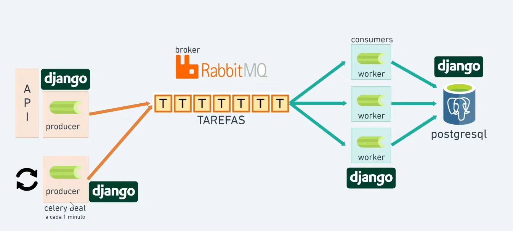
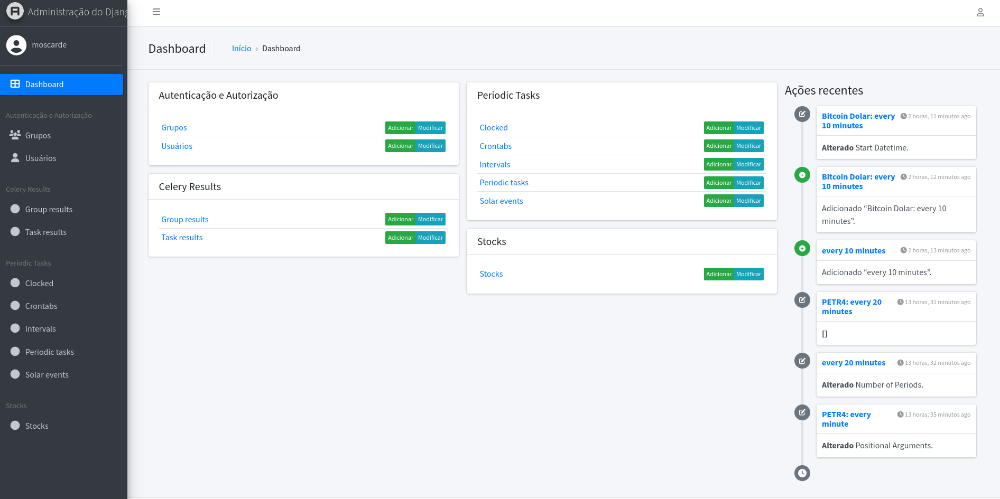
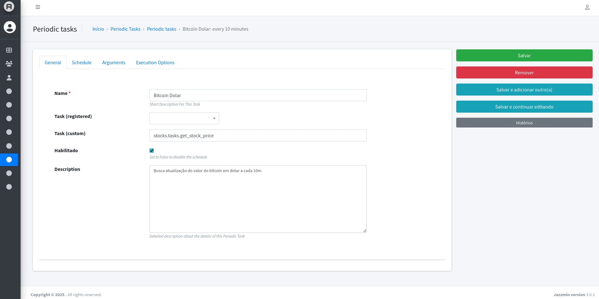
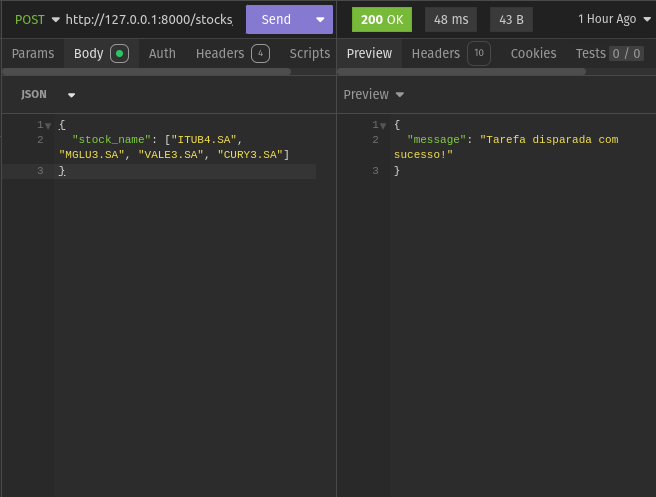
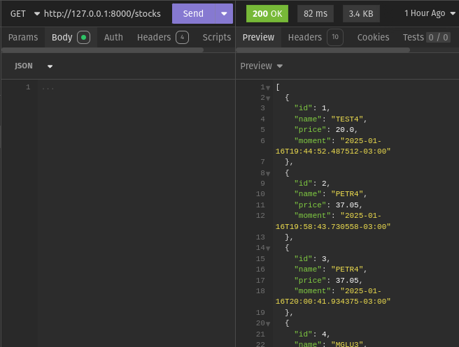

# Django + Celery - Obtenção de Preços de Ações


Este é um projeto de estudo e compreensão da ferramenta Celery em conjunto com Django, criando uma API para obter preços de ações e processar essas informações em segundo plano com Celery. O projeto utiliza o `yfinance` para buscar os preços de ações e oferece endpoints REST para interagir com o sistema.

*O projeto é uma adaptação de um livecode do canal Pycode no Youtube, disponível [neste vídeo](https://www.youtube.com/live/IBAff6euF64?si=G7ZYku0FvPZfY16d)* 

## Funcionalidades

- **GET /stocks/**: Recupera a lista de ações e seus valores mais recentes.
- **POST /stocks/**: Envia uma ou mais ações para serem processadas pelo backend e obter seus preços. `Como o objetivo do projeto era estudar a integração Django + Celery, o POST /stocks/ retorna imediatamente uma resposta, enquanto repassa para o backend o processamento.`

### Tecnologias

- **Django**: Framework de desenvolvimento web.
- **Celery**: Ferramenta para execução de tarefas assíncronas.
- **yfinance**: Biblioteca para obtenção de dados financeiros de ações.
- **Django REST Framework**: Ferramenta para criação de APIs em Django.
- **django-celery-results**: Backend para armazenar os resultados de tarefas Celery.
- **django-celery-beat**: Extensão para agendamento de tarefas no Celery.
- **django-jazzmin**: Ferramenta para personalizar o painel de administração do Django.

## Screenshots

### Django - Admin (jazzmin)

|  |  |
| --- | --- |

### Rotas

|  |  |
| --- | --- |

## Pré-requisitos

Certifique-se de ter o Docker e o Docker Compose instalados no seu sistema. Você pode obter as instruções de instalação no site oficial do Docker.

## Configuração e Execução

1. **Clonar o repositório**
    
    Primeiro, clone este repositório para sua máquina local.
```bash
git clone https://github.com/Moscarde/django_celery_stock_prices
cd https://github.com/Moscarde/django_celery_stock_prices
```
2. **Construir a imagem Docker**

Para construir a imagem Docker com base no arquivo `Dockerfile`, execute o seguinte comando:
```
docker compose build
```
3. **Subir os containers**

Após construir as imagens, inicie os containers com o Docker Compose:
```
docker compose up
```
Esse comando iniciará os containers do Django, Celery e Celery Beat, além do banco de dados SQLite.

4. **Criar superusuário Django**

Para acessar o painel de administração do Django, você precisará criar um superusuário. Para isso, execute o comando a seguir:
```
docker compose exec web python manage.py createsuperuser
```
Você será solicitado a fornecer um nome de usuário, e-mail e senha.

5. **Acessar a API e o Painel Administrativo**
	
	- **API**: A API estará disponível em `http://localhost:8000/stocks/price/` para requisições GET e POST.
	- **Admin**: O painel administrativo do Django estará disponível em `http://localhost:8000/admin/`. Utilize o superusuário criado para acessar.
    
6. **Exemplo de uso**
    
	Após subir o projeto e criar o superusuário, você pode enviar requisições POST para a API para processar o preço de ações.
	    
##### **POST**: `/stocks/`
    
Corpo da requisição:
```json
{
    "stock_names": ["AAPL", "GOOG", "AMZN"]
}    
```

Isso fará com que as ações solicitadas sejam processadas pelo backend e os preços serão obtidos de forma assíncrona pelo Celery.

##### **GET**: `/stocks/`

Retorna um json com detalhes de todas as ações já processadas.

## Observações

- **YFinance**: O `yfinance` é utilizado para obter os preços históricos das ações. A função `request_stock_price` consulta o preço de fechamento mais recente de uma ação.
- **Celery**: O Celery é configurado para processar tarefas assíncronas de forma que a obtenção do preço de ações não bloqueie o restante do sistema.
